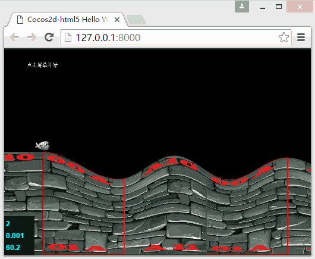

#如何制作一个类似Tiny Wings的游戏 cocos2d-js 3.12

这个文章，主要是根据[How To Create A Game Like Tiny Wings with Cocos2D 2.X](https://www.raywenderlich.com/32958/how-to-create-a-game-like-tiny-wings-with-cocos2d-2-x-part-2)，用cocos2d-x js 3.12实现了一遍，[How To Create A Game Like Tiny Wings with Cocos2D 2.X](https://www.raywenderlich.com/32958/how-to-create-a-game-like-tiny-wings-with-cocos2d-2-x-part-2)是个人接触到比较好的教程之一，把设计思路和技术点有条不紊的细细道来，让看的人仿佛在看一个人作画，先是整体线稿，然后是逐渐细化，然后是细节描绘，最后再加一两处亮点，让人看的舒服，按这套路写代码，也是写的舒服，比如教程里地形的处理，先是用线段描绘出地形的大体，然后再调节地形各起伏点的范围，再把用作地形的线段修的圆润，再加上动态纹理，最后增加当鸟飞的高，地形动态缩放的亮点，一气看下来，真是行云流水。

看到[How To Create A Game Like Tiny Wings with Cocos2D 2.X](https://www.raywenderlich.com/32958/how-to-create-a-game-like-tiny-wings-with-cocos2d-2-x-part-2)的翻译文章 ：[（译）如何制作一个类似tiny wings的游戏](http://www.cnblogs.com/zilongshanren/archive/2011/07/01/2095489.html)
和一篇转为Cocos2d-x 2.1.4的文章[如何制作一个类似Tiny Wings的游戏(2) Cocos2d-x 2.1.4](http://blog.csdn.net/akof1314/article/details/9293797)以及一篇扩展文章
[cocos2dx实现自定义2D地形](http://blog.csdn.net/z104207/article/details/44591865)，没看到用cocos2d-js的实现，就简单实现了一份cocos2d-js的版本。

个人主要是根据这个文章[如何制作一个类似Tiny Wings的游戏(2) Cocos2d-x 2.1.4](http://blog.csdn.net/akof1314/article/details/9293797)实现cocos2d-js版本，所以文章只列举cocos2d-js特有部分，对项目的整体设计和实现过程可以参看[如何制作一个类似Tiny Wings的游戏(2) Cocos2d-x 2.1.4](http://blog.csdn.net/akof1314/article/details/9293797)

##序
原教程用的是box2d 物理引擎，因为想在浏览器和手机上运行，而cocos2d-x jsb的物理引擎接口只有Chipmunk？就把物理引擎换为了Chipmunk

通过这个文章和代码可以了解到
1. cocos 设置
2. cocos2d-js 项目创建和运行
3. cocos2d-js 开发环境设置
4. cocos2d-js 里物理引擎Chipmunk简单使用
5. 用cocos2d-js封装的webgl动态绘制由三角形拼成的地形
6. cocos2d-js 用户输入事件的处理

##cocos 设置
下载了引擎后，创建、编译、运行项目需要用到引擎自带的cocos命令，列一下配置

1. 下载python 2.7版本，安装
2. 下载apache-ant，解压到磁盘目录
3. 下载Android NDK，安装
4. 下载Android SDK，安装
5. 下载cocos2d-x-3.12，解压到磁盘目录
6. 打开命令行窗口，进入上一步的解压目录
7. 执行 python setup.py 根据提示信息设置相应目录
8. 在上一步骤设置正确后，打开新的命令行窗口，执行：cocos new 你的工程名 -p 你工程的包名 -d 你工程的存放目录 -l js

通过以上会建立一个cocos2d-x 项目，工程使用的编程语言为js。

##开发环境设置

工欲善其事必先利器，一个好的开发工具，会带来事半功倍的效果，做cocos2d-x JS的开发，个人用过的工具链：

> 1. 文本编辑器 + chrome + cocos命令
2. Visual Studio code + Chrome + cocos命令/http-server
3. Webstorm + Chrome

用1或2方法，需要一个http服务，可用cocos2d-x引擎的命令：`cocos run -p web` 或者选择其它的http服务，比如http-server，这两个都有一个缺点，就是项目修改后，有时要清理下浏览器缓存和重启下服务才有更新。

方法3不需要额外做操作，并且调试和开发功能强大，但是对配置要求高，个人机器可能配置不高，Webstorm打开要几分钟，开发和调试都缓慢的反应，让开发趣味低很多，于是换到了方法2，下面列下方法2的环境配置。

> 注意：这是配置cocos2d-x JS的开发环境，cocos2d-x JSB的调试环境配置可以参考这个文章：[Use VSCode to debug cocos2d-x JSB programs][2]

1. 下载Visual Studio Code 安装
2. 下载chrome 安装
3. 下载Node.js 安装，（因为远程调试需要一个服务器环境，http-server基于Node.js开发）
4. 如果是Node官网的安装包，安装Node.js会把NPM也一同装上
5. 在命令行窗口，执行：npm install -g http-server 安装一个简易的http服务器
6. 在命令行窗口执行，http-server 这样就有了一个运行中的http服务器
7. 给Visual Studio Code安装扩展Debugger for Chrome
8. 在Debugger for Chrome安装完成，按提示重启Visual Studio Code
9. 用Visual Studio Code的【打开文件夹】菜单项，打开你创建项目的根目录
10. 切换到调试，配置你的调试环境，非常方便，就点三下，流程如下图
    
11. 现在开发环境的调试也配置好了，一个http服务器也在运行，还缺少最后一个配置
12. 给Chrome建立一个桌面的快捷方式，在目标设置的最后，添加如下： --remote-debugging-port=9222
    
13. 点设置好的chrome快捷方式，启动一个Chrome窗口
14. 切换到Visual Studio Code应用，执行Start Debugging(F5)
    

>额外

>方便规范化代码格式，可以安装ESLint，具体设置可以参考这个文章：[Visual Studio Code 使用 ESLint 增强代码风格检查][6]

> 如果是用cocos run -p web来启动服务，可以不用安装htthttp-server

##代码部分
代码地址：[https://github.com/sunjianhua/birdgame.git][7]，这个是没有包含cocos2d-js运行库的，可以用上面讲到的方式，创建一个cocos2d-js的新项目（cocos new 你的工程名 -p 你工程的包名 -d 你工程的存放目录 -l js），把对应的文件用[https://github.com/sunjianhua/birdgame.git][8]覆盖就可以。

代码处理好后，运行项目（cocos run -p web），会看到如下效果

因为项目是从cocos2d-x 2.14 移植到cocos2d-js 3.12，除了

运行环境（应用程序转为网页）
编程语言（从c++转为javascript）
物理引擎（从box2d转为chipmunk)、
引擎版本（从2.14转为3.12）

有调整外，项目整体的设计和函数的命名基本没有变化，并且先前一些人写的文章，已经很详尽就不在此重复，可以去看下面文章：
[How To Create A Game Like Tiny Wings with Cocos2D 2.X](https://www.raywenderlich.com/32958/how-to-create-a-game-like-tiny-wings-with-cocos2d-2-x-part-2)
[（译）如何制作一个类似tiny wings的游戏](http://www.cnblogs.com/zilongshanren/archive/2011/07/01/2095489.html)
[如何制作一个类似Tiny Wings的游戏(2) Cocos2d-x 2.1.4](http://blog.csdn.net/akof1314/article/details/9293797)

##额外
1. 初始创建的项目是没有包含物理引擎的，需要在project.json里把物理模块指定一下
2. 新增加的文件也是要在project.json里指定

> 这个项目的物理效果没有细调，但是就这样吧。
